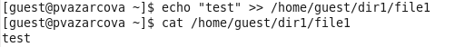
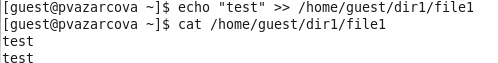
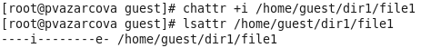
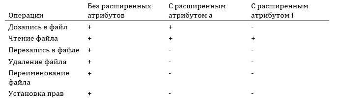

---
## Front matter
lang: ru-RU
title: Лабораторная работа №4
author: |
	Азарцова Полина Валерьевна - группа НКНбд-01-18
date: 30.10.2021

## Formatting
toc: false
slide_level: 2
theme: metropolis
header-includes: 
 - \metroset{progressbar=frametitle,sectionpage=progressbar,numbering=fraction}
 - '\makeatletter'
 - '\beamer@ignorenonframefalse'
 - '\makeatother'
aspectratio: 43
section-titles: true
---

# Дискреционное разграничение прав в Linux. Расширенные атрибуты

## Прагматика выполнения

- Расширенные атрибуты файлов используются, чтобы помочь классифицировать файлы определенным образом.

## Цель выполнения лабораторной работы

- Получение практических навыков работы в консоли с расширенными атрибутами файлов

## Задачи выполнения лабораторной работы

- Установить на файл расширенный атрибут 'a' и выполнить ряд операций.
- Снять расширенный атрибут 'a' с файла и повторить операции, которые не удалось выполнить ранее.
- Заменить атрибут 'a' расширенным атрибутом 'i' и повторить все операции.
- Составить наглядную таблицу, поясняющую какие операции возможны при установленных атрибутах.

## Результаты выполнения лабораторной работы

- Установила расширенный атрибут 'a' на файл /home/guest/dir1/file1 от имени суперпользователя. (рис - @fig:001).

{ #fig:001 width=70% }

Выполнила ряд команд, например, выполнила дозапись слова в файл и чтение файла. (рис -@fig:002).

{ #fig:002 width=70% }

##

- Сняла расширенный атрибут 'a' с файла и повторила операции, которые ранее не удавалось выполнить. (рис -@fig:003, рис -@fig:004).

{ #fig:003 width=70% }

{ #fig:004 width=70% }

##

- Заменила расширенный атрибут 'a' расширенным атрибутом 'i' и повторила операции. (рис -@fig:005, рис -@fig:006).

{ #fig:005 width=70% }

{ #fig:006 width=70% }

##

- Была составлена наглядная таблица, поясняющая какие операции возможны при установленных атрибутах. (рис -@fig:007)

{ #fig:007 width=70% }

##

Таким образом, я получила практические навыки работы в консоли с расширенными атрибутами файлов