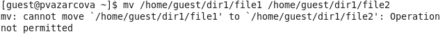

---
# Front matter
lang: ru-RU
title: "Лабораторная работа №4"
subtitle: "Дискреционное разграничение прав в Linux. Расширенные атрибуты"
author: "Азарцова Полина Валерьевна"

# Formatting
toc-title: "Содержание"
toc: true # Table of contents
toc_depth: 2
lof: true # List of figures
lot: true # List of tables
fontsize: 12pt
linestretch: 1.5
papersize: a4paper
documentclass: scrreprt
polyglossia-lang: russian
polyglossia-otherlangs: english
mainfont: PT Serif
romanfont: PT Serif
sansfont: PT Sans
monofont: PT Mono
mainfontoptions: Ligatures=TeX
romanfontoptions: Ligatures=TeX
sansfontoptions: Ligatures=TeX,Scale=MatchLowercase
monofontoptions: Scale=MatchLowercase
indent: true
pdf-engine: lualatex
header-includes:
  - \linepenalty=10 # the penalty added to the badness of each line within a paragraph (no associated penalty node) Increasing the value makes tex try to have fewer lines in the paragraph.
  - \interlinepenalty=0 # value of the penalty (node) added after each line of a paragraph.
  - \hyphenpenalty=50 # the penalty for line breaking at an automatically inserted hyphen
  - \exhyphenpenalty=50 # the penalty for line breaking at an explicit hyphen
  - \binoppenalty=700 # the penalty for breaking a line at a binary operator
  - \relpenalty=500 # the penalty for breaking a line at a relation
  - \clubpenalty=150 # extra penalty for breaking after first line of a paragraph
  - \widowpenalty=150 # extra penalty for breaking before last line of a paragraph
  - \displaywidowpenalty=50 # extra penalty for breaking before last line before a display math
  - \brokenpenalty=100 # extra penalty for page breaking after a hyphenated line
  - \predisplaypenalty=10000 # penalty for breaking before a display
  - \postdisplaypenalty=0 # penalty for breaking after a display
  - \floatingpenalty = 20000 # penalty for splitting an insertion (can only be split footnote in standard LaTeX)
  - \raggedbottom # or \flushbottom
  - \usepackage{float} # keep figures where there are in the text
  - \floatplacement{figure}{H} # keep figures where there are in the text
---

# Цель работы

Получение практических навыков работы в консоли с расширенными атрибутами файлов.

# Задание

1. Установить на файл расширенный атрибут 'a' и выполнить ряд операций.
2. Снять расширенный атрибут 'a' с файла и повторить операции, которые не удалось выполнить ранее.
3. Заменить атрибут 'a' расширенным атрибутом 'i' и повторить все операции.
4. Составить наглядную таблицу, поясняющую какие операции возможны при установленных атрибутах.

# Выполнение лабораторной работы

1.1  От имени пользователя guest определила расширенные атрибуты файла /home/guest/dir1/file1 командой 'lsattr /home/guest/dir1/file1'.  (рис - @fig:001).

{ #fig:001 width=70% }

1.2 Установила командой 'chmod 600 file1' на файл file1 права, разрешающие чтение и запись для владельца файла (рис -@fig:002).

{ #fig:002 width=70% }

1.3 Попробовала установить на файл /home/guest/dir1/file1 расширенный атрибут 'a' от имени пользователя guest с помощью команды '+a /home/guest/dir1/file1' (рис -@fig:003).

{ #fig:003 width=70% }

В ответ получила отказ от выполнения операции.  

1.4 В отдельной консоли повысила свои права с помощью команды 'su'. Установила расширенный атрибут 'a' на файл /home/guest/dir1/file1 от имени суперпользователя с помощью команды 'chattr +a /home/guest/dir1/file1'. (рис -@fig:004)

{ #fig:004 width=70% }

1.5 От пользователя guest проверила правильность установления атрибута с помощью команды 'lsattr /home/guest/dir1/file1' (рис. -@fig:005)

{ #fig:005 width=70% }

1.6 Выполнила дозапись в файл file1 слова "test" командой 'echo >> "test" /home/guest/dir1/file1'. Дозапись удалась. После этого выполнила чтение файла file1 командой 'cat /home/guest/dir1/file1'. Чтение так же удалось. Убедилась, что слово "test" было успешно записано в file1. (рис -@fig:006).

{ #fig:006 width=70% }

1.7 Попробовала удалить файл file1 с помощью команды 'rm /home/guest/dir1/file1'. Удаление файла не удалось. (рис. -@fig:007)

{ #fig:007 width=70% }

Также попробовала стереть имеющуюся в файле информацию командой 'echo "abcd" > /home/guest/dir1/file1'. Выполнение команды также не удалось. (рис. -@fig:008)

{ #fig:008 width=70% }

Попробовала переименовать файл с помощью команды 'mv /home/guest/dir1/file1 /home/guest/dir1/file2'. Переименование файла не удалось. (рис. -@fig:009)

{ #fig:009 width=70% }

1.8 Попробовала с помощью команды 'chmod 000 file1' установить на файл file1 права, запрещающие чтение и запись для владельца файла. Установка прав не удалась. (рис -@fig:010)

{ #fig:010 width=70% }

2.1 Сняла расширенный атрибут 'a' с файла /home/guest/dir1/file1 от имени суперпользователя командой 'chattr -a /home/guest/dir1/file1' (рис -@fig:011)

{ #fig:011 width=70% }

2.2 Повторила операции, которые ранее не удавалось выполнить (рис -@fig:012, рис -@fig:013, рис -@fig:014, рис -@fig:015).

{ #fig:012 width=70% }

{ #fig:013 width=70% }

{ #fig:014 width=70% }

{ #fig:015 width=70% }

Все вышеприведенные на скриншотах операции удалось выполнить после снятия атрибута 'a'.

3.1 Заменила атрибут 'a' расширенным атрибутом 'i'. (рис -@fig:016)

(Перед установкой атрибута вернула файлу file2 первоначальное именование file1)

{ #fig:016 width=70% }

3.2 Повторила по шагам все операции уже с установленным расширенным атрибутом 'i'. Никакие из нижеприведенных на скриншотах операций: дозапись командой 'echo >>', перезапись командой 'echo >', удаление файла командой 'rm', переименование файла командой 'mv', установка прав на файл командой 'chmod', кроме чтения файла командой 'cat', выполнить не удалось. (рис -@fig:017, рис -@fig:018, рис -@fig:019, рис -@fig:020, рис -@fig:021, рис -@fig:022)

{ #fig:017 width=70% }

{ #fig:018 width=70% }

{ #fig:019 width=70% }

{ #fig:020 width=70% }

{ #fig:021 width=70% }

{ #fig:022 width=70% }

4. Составила наглядную таблицу, поясняющую какие операции возможны при установленных атрибутах. (таб. 3.1)

|Операции                 |Без расширенных атрибутов|С расширенным атрибутом а|С расширенным атрибутом i|
|-------------------------|-------------------------|-------------------------|-------------------------|
|Дозапись в файл          |+                        |+                        |-                        |
|Чтение файла             |+                        |+                        |+                        |
|Перезапись в файле       |+                        |-                        |-                        |
|Удаление файла           |+                        |-                        |-                        |
|Переименование файла     |+                        |-                        |-                        |
|Установка прав           |+                        |-                        |-                        |

: Результат проведения операций при установленных расширенных атрибутах 'a' и 'i'

# Выводы

Познакомилась на примерах с тем, как используются основные и расширенные атрибуты при разграничении доступа. Опробовала действие на практике расширенных атрибутов 'а' и 'i'. Получила практические навыки работы в консоли с расширенными атрибутами файлов.

# Список литературы

1. Кулябов Д. С., Королькова А. В., Геворкян М. Н. Информационная безопасность компьютерных сетей. Лабораторная работа № 4. Дискреционное разграничение прав в Linux. Расширенные атрибуты
