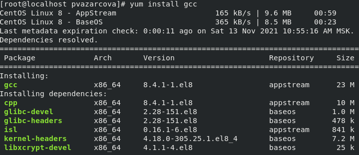
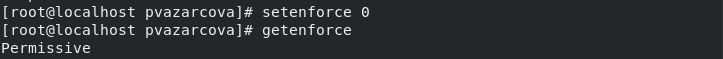
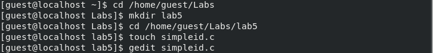
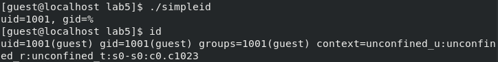
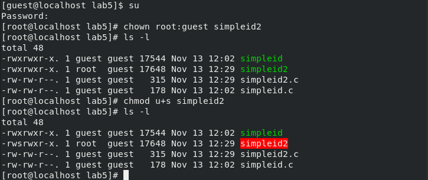
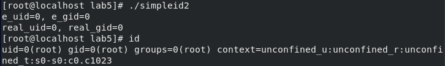
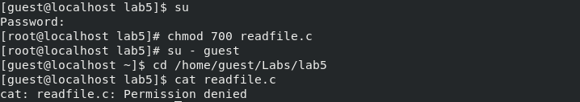
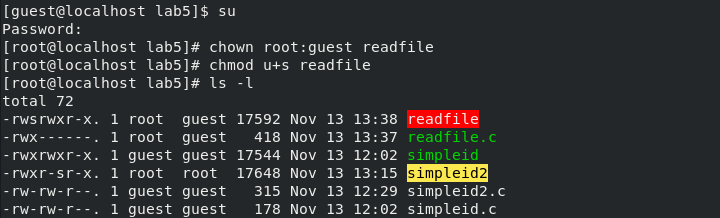
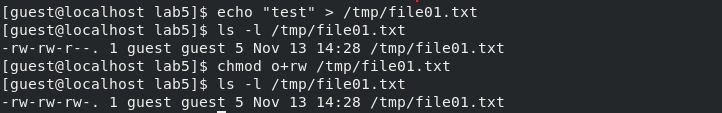
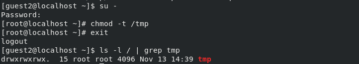

---
## Front matter
lang: ru-RU
title: Лабораторная работа №5
author: |
	Азарцова Полина Валерьевна - группа НКНбд-01-18
date: 30.10.2021

## Formatting
toc: false
slide_level: 2
theme: metropolis
header-includes: 
 - \metroset{progressbar=frametitle,sectionpage=progressbar,numbering=fraction}
 - '\makeatletter'
 - '\beamer@ignorenonframefalse'
 - '\makeatother'
aspectratio: 43
section-titles: true
---

# Дискреционное разграничение прав в Linux. Исследование влияния дополнительных атрибутов

## Прагматика выполнения

- Свойства SetGID и SetUID битов.

## Цель выполнения лабораторной работы

- Изучение механизмов изменения идентификаторов, применения SetUID- и Sticky-битов. Получение практических навыков работы в консоли с дополнительными атрибутами. Рассмотрение работы механизма смены идентификатора процессов пользователей, а также влияние бита Sticky на запись и удаление файлов.

## Задачи выполнения лабораторной работы

- Подготовить к выполнению лабораторной необходимые средства разработки.
- По порядку выполнить все пункты из раздела "создание программы".
- По порядку выполнить все пункты из раздела "исследование Sticky-бита".

## Результаты выполнения лабораторной работы

- Установила компилятор gcc с помощью команды 'yum install gcc'.  (рис - @fig:001, рис - @fig:002).

{ #fig:001 width=70% }

- Отключила систему защиты SELinux на текущую сессию командой 'setenforce 0'. Проверила выполнение командой 'getenforce', которая вывела Permissive (рис -@fig:003).

{ #fig:002 width=70% }

##

- Cоздала программу simpleid.c от имени пользователя guest, выполнила ее и сравнила результат с системной программой id. (рис -@fig:003, рис -@fig:004).

{ #fig:003 width=70% }

{ #fig:004 width=70% }

##

- Усложнила программу, сменила владельца и установила SetUID, выполнила simpleid2 и сравнила результат с системной программой id. (рис -@fig:005, рис -@fig:006).

{ #fig:005 width=70% }

{ #fig:006 width=70% }

##

- Создала программу readfile.c, сменила владельца и изменила права(рис -@fig:007)

{ #fig:007 width=70% }

- Сменила у программы readfile владельца и установила SetUID (рис -@fig:008).

{ #fig:008 width=70% }

##

- От имени пользователя guest создала файл file01.txt, разрешила чтение и запись для категории пользователей «все остальные» и выполнила ряд действий. (рис -@fig:009).

{ #fig:009 width=70% }

- Сняла атрибут t с директории /tmp и повторила выполнение ряда действий. (рис -@fig:010).

{ #fig:010 width=70% }

##

Таким образом, я изучила механизмы изменения идентификаторов, применения SetUID- и Sticky-битов. Получила практические навыки работы в консоли с дополнительными атрибутами. Рассмотрела работу механизма смены идентификатора процессов пользователей, а также влияние бита Sticky на запись и удаление файлов.