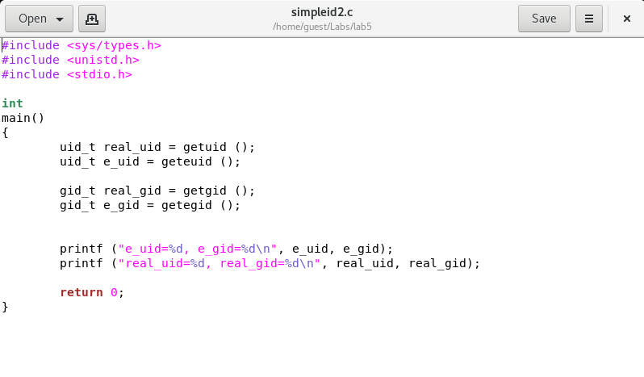
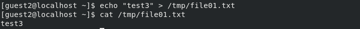

---
# Front matter
lang: ru-RU
title: "Лабораторная работа №5"
subtitle: "Дискреционное разграничение прав в Linux.  Исследование влияния дополнительных атрибутов"
author: "Азарцова Полина Валерьевна"

# Formatting
toc-title: "Содержание"
toc: true # Table of contents
toc_depth: 2
lof: true # List of figures
lot: true # List of tables
fontsize: 12pt
linestretch: 1.5
papersize: a4paper
documentclass: scrreprt
polyglossia-lang: russian
polyglossia-otherlangs: english
mainfont: PT Serif
romanfont: PT Serif
sansfont: PT Sans
monofont: PT Mono
mainfontoptions: Ligatures=TeX
romanfontoptions: Ligatures=TeX
sansfontoptions: Ligatures=TeX,Scale=MatchLowercase
monofontoptions: Scale=MatchLowercase
indent: true
pdf-engine: lualatex
header-includes:
  - \linepenalty=10 # the penalty added to the badness of each line within a paragraph (no associated penalty node) Increasing the value makes tex try to have fewer lines in the paragraph.
  - \interlinepenalty=0 # value of the penalty (node) added after each line of a paragraph.
  - \hyphenpenalty=50 # the penalty for line breaking at an automatically inserted hyphen
  - \exhyphenpenalty=50 # the penalty for line breaking at an explicit hyphen
  - \binoppenalty=700 # the penalty for breaking a line at a binary operator
  - \relpenalty=500 # the penalty for breaking a line at a relation
  - \clubpenalty=150 # extra penalty for breaking after first line of a paragraph
  - \widowpenalty=150 # extra penalty for breaking before last line of a paragraph
  - \displaywidowpenalty=50 # extra penalty for breaking before last line before a display math
  - \brokenpenalty=100 # extra penalty for page breaking after a hyphenated line
  - \predisplaypenalty=10000 # penalty for breaking before a display
  - \postdisplaypenalty=0 # penalty for breaking after a display
  - \floatingpenalty = 20000 # penalty for splitting an insertion (can only be split footnote in standard LaTeX)
  - \raggedbottom # or \flushbottom
  - \usepackage{float} # keep figures where there are in the text
  - \floatplacement{figure}{H} # keep figures where there are in the text
---

# Цель работы

Изучение механизмов изменения идентификаторов, применения SetUID- и Sticky-битов. Получение практических навыков работы в консоли с дополнительными атрибутами. Рассмотрение работы механизма смены идентификатора процессов пользователей, а также влияние бита Sticky на запись и удаление файлов.

# Задание

1. Подготовить к выполнению лабораторной необходимые средства разработки.
2. По порядку выполнить все пункты из раздела "создание программы".
3. По порядку выполнить все пункты из раздела "исследование Sticky-бита".

# Выполнение лабораторной работы

1.1  Установила компилятор gcc с помощью команды 'yum install gcc'.  (рис - @fig:001, рис - @fig:002).

{ #fig:001 width=70% }

{ #fig:002 width=70% }

1.2 Отключила систему защиты SELinux на текущую сессию командой 'setenforce 0'. Проверила выполнение командой 'getenforce', которая вывела Permissive (рис -@fig:003).

{ #fig:003 width=70% }

2.1 Вошла в систему от имени пользователя guest, создала программу simpleid.c и папку лабораторной с помощью команд 'touch' и 'mkdir'. (рис -@fig:004, рис -@fig:005).

{ #fig:004 width=70% }

{ #fig:005 width=70% }

2.2 Скомпилировала программу и убедилась, что файл программы создан с помощью программы 'gcc simpleid.c -o simpleid'. (рис -@fig:006)

{ #fig:006 width=70% }

2.3 Выполнила программу simpleid с помощью './simpleid' и системную программу 'id' и сравнила полученный результат (рис. -@fig:007)

{ #fig:005 width=70% }

Полученные значения id совпадают.

2.4 Усложнила программу, добавив вывод действительных идентификаторов, назвала программу simpleid2. (рис -@fig:008, рис -@fig:009).

{ #fig:008 width=70% }

{ #fig:009 width=70% }

2.5 Скомпилировала и запустила программу simpleid2. (рис. -@fig:010)

{ #fig:010 width=70% }

2.6 От имени суперпользователя выполнила команды: 'chown root:guest /home/guest/simpleid2' и 'chmod u+s /home/guest/simpleid2', а также выполнила  проверку изменений с помощью команды 'ls -l simpleid2'. (рис. -@fig:011)

{ #fig:011 width=70% }

Первая команда изменяет права на файл с guest на root. А затем устанавливает атрибут SetUID.

2.7 Запустила simpleid2 и id, сравнила полученные результаты. (рис. -@fig:012)

{ #fig:012 width=70% }

Полученные значения совпадают.

2.8 Проделала то же самое относительно SetGID (установление прав для владеющей группы). (рис -@fig:013)

{ #fig:013 width=70% }

2.9 Создала программу readfile.c (рис -@fig:014, рис -@fig:015)

{ #fig:014 width=70% }

{ #fig:015 width=70% }

2.10 Откомпилировала программу readfile.c (рис -@fig:016).

{ #fig:016 width=70% }

2.11 Сменила владельца у файла readfile.c и изменила права так, чтобы только суперпользователь мог прочитать его, a guest не мог. Проверила, что пользователь guest не может прочитать файл readfile.c (рис -@fig:017)

{ #fig:017 width=70% }

2.12 Сменила у программы readfile владельца и установила SetUID (рис -@fig:018).

{ #fig:018 width=70% }

2.13 Проверила, может ли программа readfile прочитать файл readfile.c (рис -@fig:019).

{ #fig:019 width=70% }

Может.

2.14 Проверила, может ли программа readfile прочитать файл /etc/shadow (рис -@fig:020).

{ #fig:020 width=70% }

3.1 Выяснила, установлен ли атрибут Sticky на директории /tmp, для чего выполнила команду 'ls -l / | grep tmp' (рис -@fig:021).

{ #fig:021 width=70% }

Установлен.

3.2 От имени пользователя guest создала файл file01.txt в директории /tmp со словом test, просмотрела атрибуты у только что созданного файла и разрешила чтение и запись для категории пользователей «все остальные» (рис -@fig:022).

{ #fig:022 width=70% }

3.3 От пользователя guest2 (не являющегося владельцем) попробовала прочитать файл /tmp/file01.txt с помощью команды 'cat /tmp/file01.txt'. Действие удалось.  (рис -@fig:023).

{ #fig:023 width=70% }

3.4 От пользователя guest2 попробовала дозаписать в файл /tmp/file01.txt слово test2 командой 'echo "test2" >> /tmp/file01.txt' и проверила содержимое файла командой 'cat /tmp/file01.txt'. Действие удалось. (рис -@fig:024).

{ #fig:024 width=70% }

3.5 От пользователя guest2 попробовала записать в файл /tmp/file01.txt слово test3, стерев при этом всю имеющуюся в файле информацию командой 'echo "test3" > /tmp/file01.txt'. Действие удалось. (рис -@fig:025).

{ #fig:025 width=70% }

3.6 От пользователя guest2 попробовала удалить файл /tmp/file01.txt командой 'rm /tmp/fileOl.txt'. Действие не удалось. (рис -@fig:026).
 
{ #fig:026 width=70% }

3.7 Повысила свои права до суперпользователя командой 'su -' и выполнила команду 'chmod -t /tmp', снимающую атрибут t с директории /tmp. После покинула режим суперпользователя командой 'exit' и от пользователя guest2 с помощью команды 'ls -l / | grep tmp' проверила, что атрибута t у директории /tmp нет.  (рис -@fig:027).

{ #fig:027 width=70% }

3.8 Повторила предыдущие шаги: чтение файла, дозапись в файл, перезапись файла, удаление файла. Удалось всё, включая удаление файла от имени пользователя, не являющегося его владельцем (рис -@fig:028).

{ #fig:028 width=70% }

3.9 Повысила свои права до суперпользователя и вернула атрибут t на директорию /tmp  (рис -@fig:029).

{ #fig:029 width=70% }

# Выводы

Изучила механизмы изменения идентификаторов, применения SetUID- и Sticky-битов. Получила практические навыки работы в консоли с дополнительными атрибутами. Рассмотрела работу механизма смены идентификатора процессов пользователей, а также влияние бита Sticky на запись и удаление файлов.

# Список литературы

1. Кулябов Д. С., Королькова А. В., Геворкян М. Н. Информационная безопасность компьютерных сетей. Лабораторная работа № 4. Дискреционное разграничение прав в Linux. Расширенные атрибуты
